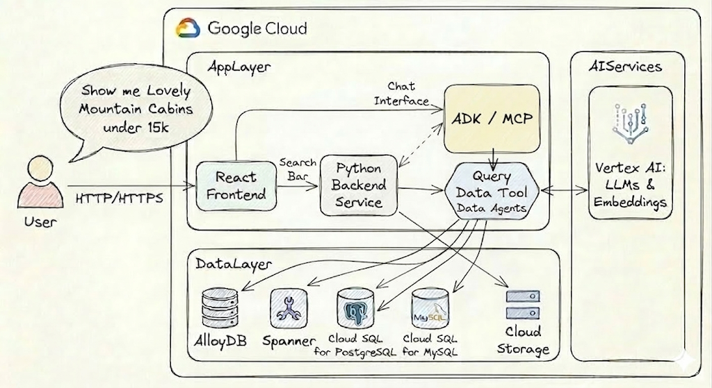

# Unified Data Cloud Property Search Demo

This application demonstrates a **Natural Language to SQL (NL2SQL)** pipeline powered by the **Gemini Data Agent**. It allows users to search for property listings using natural language queries, which are translated into SQL and executed against three parallel database backends: **AlloyDB**, **Cloud Spanner**, and **Cloud SQL for PostgreSQL**.

## Architecture



*   **Frontend**: React application (Vite) with a modern UI and a 3-way toggle to switch between database backends.
*   **Backend**: FastAPI (Python) service that proxies requests to the Gemini Data Agent API, logs prompt history to the active database, and serves images securely from Google Cloud Storage.
*   **ADK Chat Agent**: A dynamic "Single Agent" architecture that instantiates on-the-fly with the specific MCP tool for the selected database.
*   **Databases**: 
    *   **AlloyDB**: PostgreSQL-compatible database using `pgvector` and ScaNN indexes.
    *   **Cloud Spanner**: Globally distributed database using Google Standard SQL and exact vector search.
    *   **Cloud SQL for PostgreSQL**: Fully managed PostgreSQL using `pgvector` and HNSW/IVFFlat indexes.

## Features

*   **Multi-Database Support**: Seamlessly switch between AlloyDB, Spanner, and Cloud SQL PG to compare performance and SQL dialects.
*   **Natural Language Search**: Ask questions like "Show me 2-bedroom apartments in Zurich under 3000 CHF".
*   **Generative AI Answers**: Get natural language summaries alongside data results.
*   **Conversational Agent**: Interact with the ADK Chat Agent for follow-up questions and refined searches.
*   **Secure Image Serving**: Images are served securely from a private GCS bucket via the backend.

## Prerequisites

*   Google Cloud Project with billing enabled.
*   AlloyDB Cluster, Cloud Spanner Instance, and Cloud SQL PG Instance.
*   Gemini Data Agent configured with all three databases as data sources.
*   Google Cloud Storage bucket for images.

## Local Development & Setup

### 1. Configure Environment

Run the setup script to configure your environment variables (Project ID, Database IDs, Credentials, and Context Set IDs):

```bash
./scripts/setup_env.sh
```

### 2. Database Initialization & Data Loading

The project includes an automated script to deploy the schemas and load the sample data (with embeddings) into all three databases via an IAP SSH tunnel to a Bastion Host.

```bash
./scripts/install_databases.sh
```

### 3. Start Services Locally

Run the local debug script to build and start the Backend, Frontend, Toolbox (MCP Server), and Agent containers:

```bash
./scripts/debug_local.sh
```
*   Frontend: http://localhost:8081
*   Backend API: http://localhost:8080
*   Toolbox UI: http://localhost:8082

## Deployment

To deploy the Frontend and Backend to Google Cloud Run:

```bash
./scripts/deploy.sh
```

## Project Structure

*   `backend/`: FastAPI application and ADK Agent service.
*   `frontend/`: React application.
*   `database_artefacts/`: DDL scripts, data generation, and context files.
*   `scripts/`: Automation scripts for setup, deployment, and local debugging.
*   `terraform/`: Infrastructure as Code to provision the databases and Bastion Host.
